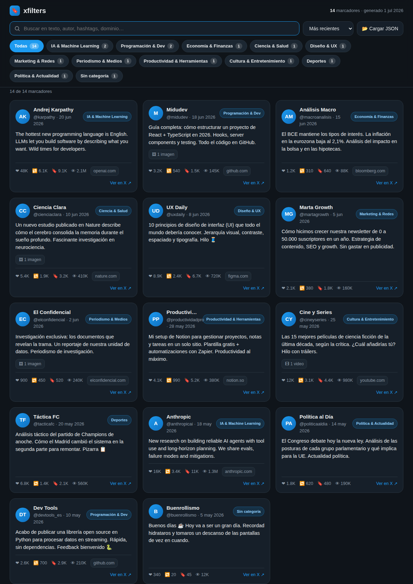

# xfilters

Recupera **todos tus marcadores de X/Twitter**, guárdalos en local en un JSON
con un **tag de categoría** (y datos extra para filtrar), y explóralos en un
**frontal HTML** donde puedes filtrar por categoría, buscar y ordenar.

Todo el proceso es **local y privado**: la captura ocurre en _tu_ navegador (ya
tienes la sesión de X iniciada), no se comparten cookies ni tokens con nadie, y
el frontal es un único `index.html` que funciona incluso abriéndolo desde disco.



## Cómo funciona (3 pasos)

```
┌─────────────────────┐    ┌────────────────────┐    ┌─────────────────────┐
│ 1. Extensión Chrome │ →  │ 2. enrich.mjs       │ →  │ 3. index.html       │
│  captura marcadores │    │  añade categoría    │    │  filtra por tag     │
│  → x-bookmarks.json │    │  → data/bookmarks.* │    │  + búsqueda + orden │
└─────────────────────┘    └────────────────────┘    └─────────────────────┘
```

### 1. Capturar tus marcadores (extensión)

La extensión de `extension/` corre en tu navegador, recorre tu página de
Marcadores y captura cada tweet interceptando las respuestas GraphQL que X ya
descarga (texto, autor, media, métricas, fecha…). Ver
[`extension/README.md`](extension/README.md) para el paso a paso.

Resultado: un archivo `x-bookmarks-AAAA-MM-DD.json`.

### 2. Enriquecer y categorizar

Copia el archivo capturado a `data/raw-bookmarks.json` y ejecuta:

```bash
node scripts/enrich.mjs
# o apuntando a un archivo concreto:
node scripts/enrich.mjs ~/Descargas/x-bookmarks-2026-07-01.json
```

Esto:

- añade a cada marcador un **`category`** (el tag principal por el que se filtra)
  y un array **`tags`** con todas las categorías que encajan,
- añade campos derivados útiles: **`domain`**, **`has_media`**, **`year`**,
- de-duplica por id y ordena por fecha,
- genera **`data/bookmarks.json`** (portable) y **`data/bookmarks.js`** (para
  que el frontal funcione sin servidor).

Las reglas de categorización viven en `scripts/enrich.mjs` (constante
`CATEGORIES`): son listas de palabras clave y dominios. Edítalas a tu gusto y
vuelve a ejecutar el script — el frontal se actualiza solo.

### 3. Ver y filtrar

Abre `index.html` (doble clic o sírvelo con `npx serve`). Puedes:

- **filtrar por categoría** con los chips (multi-selección),
- **buscar** en texto, autor, hashtags y dominio,
- **ordenar** por fecha, likes, guardados o vistas,
- **cargar otro JSON** desde el propio frontal con «📂 Cargar JSON».

## Estructura del proyecto

```
xfilters/
├── index.html                 Frontal (autónomo: CSS + JS inline)
├── extension/                 Extensión Chrome MV3 para capturar marcadores
│   ├── manifest.json
│   ├── collector.js           Hook de red + auto-scroll + panel + descarga
│   ├── icon.png
│   └── README.md              Instrucciones de instalación y uso
├── scripts/
│   └── enrich.mjs             Normaliza + categoriza → data/bookmarks.{json,js}
└── data/
    ├── bookmarks.sample.json  Datos de ejemplo (para la demo)
    ├── bookmarks.json         Generado: marcadores enriquecidos
    └── bookmarks.js           Generado: window.__XFILTERS__ (para file://)
```

El repo se entrega con **datos de ejemplo** ya cargados para que el frontal se
vea funcionando desde el primer momento. Cuando captures tus marcadores reales,
el paso 2 sobrescribe `data/bookmarks.{json,js}` con los tuyos.

## Esquema de cada marcador

```jsonc
{
  "id": "1790…",
  "url": "https://x.com/usuario/status/1790…",
  "text": "…",
  "lang": "es",
  "created_at": "2026-06-20T09:12:00.000Z",
  "author": { "name": "…", "handle": "usuario", "avatar": "https://…" },
  "media": [{ "type": "photo|video|animated_gif", "url": "…", "thumb": "…" }],
  "metrics": { "likes": 0, "retweets": 0, "replies": 0, "quotes": 0, "bookmarks": 0, "views": 0 },
  "hashtags": ["…"], "mentions": ["…"], "links": ["https://…"],
  "is_quote": false,
  // añadidos por enrich.mjs:
  "category": "IA & Machine Learning",
  "tags": ["IA & Machine Learning", "Programación & Dev"],
  "domain": "openai.com",
  "has_media": false,
  "year": 2026
}
```

## Privacidad

- La extensión **no** transmite nada: lee las respuestas que tu navegador ya
  recibe y descarga un archivo local.
- No se piden ni almacenan credenciales, cookies ni tokens.
- El frontal es estático; no hace peticiones a servidores externos salvo cargar
  las imágenes/avatares de X que aparezcan en las tarjetas.
